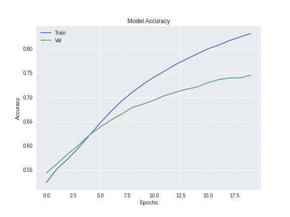
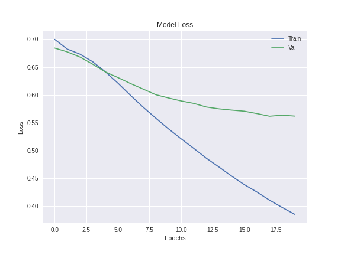

# Predicting Music Similarity

## Project Overview
Recommender System is one of the fields that Deep learning is most actively applied. Outstanding recommendeing algorithm creates positive cycle of more engagement and activity on the platform, resulting in more behavioral data to fuel the algorithm to improve its performance. Despite many proven ways to build a recommender system, this project focuses on using song lyrics to predict if two songs are similar or different. 

## Dataset
Data was from [The Million Song Dataset](http://millionsongdataset.com). It is a huge repository of music metadata and audio features. It also provides number of APIs to query for additional data such as lyrics and audio files. For this project, LastFM's data was used for music similarity and musicXmatch was used to retrieve song lyrics. These data were provided in sqlite database with tracking ID, which made easy to combine multiple source of data into one dataset. Due to copyright issues, the dataset was unable to have full lyrics. Instead, it was provided in a bag-of-words style. 

## Model Overview
The overall architecture of the model used in the project builds upon Embedding and Bidirectional LSTM. Lyrics are preprocessed and sequenced first, then it was passed into pre-trained GloVe embedding and LSTM layers which followed by several fully connected layers. The model's hyperparameters (# of fully connected layers, learning rate, hidden units) were tuned using keras-tuner. See [here](https://colab.research.google.com/drive/1W_IWOotaY1LR5kWrUiSmraeKNn-stvlp?usp=sharing) for details
 
 

## Results
The model was trained for 20 epochs with batch size of 32. The total time to finish training was about 3 hours on google colab's GPU. For better performance, consider other approaches such as more rigorous hyperparameter tuning, different model architecture and more training data with original lyrics. 
 
| Model | Loss | Accuracy |
| ----- | ---- | -------- |
|Bi-LSTM| 0.55 | 80%  |
 
 
 

## Reference
[Deep Playlist: Using Recurrent Neural Network to Predict Song Similarity](https://cs224d.stanford.edu/reports/BalakrishnanDixit.pdf)
 
Data - Thierry Bertin-Mahieux, Daniel P.W. Ellis, Brian Whitman, and Paul Lamere. 
The Million Song Dataset. In Proceedings of the 12th International Society
for Music Information Retrieval Conference (ISMIR 2011), 2011.
